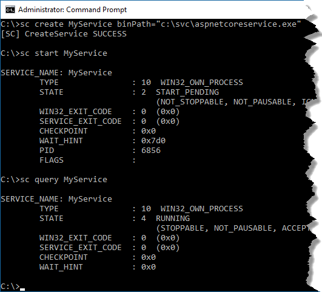
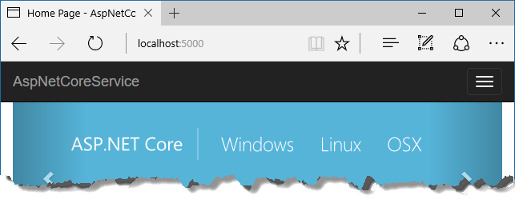

# Host an ASP.NET Core app in a Windows Service

If you're hosting your app on Windows without using IIS, and you run the app as a console application, someone will have to log in and start it manually after every reboot.  To solve that problem, you can run in a [Windows Service](https://msdn.microsoft.com/library/d56de412). This article shows how to do that.

[View or download sample code](https://github.com/aspnet/Docs/tree/master/aspnetcore/hosting/windows-service/sample)

## Prerequisites

* The app must run on the .NET framework runtime.  In the *.csproj* file, specify appropriate values for [TargetFramework](https://docs.microsoft.com/nuget/schema/target-frameworks) and [RuntimeIdentifier](https://docs.microsoft.com/dotnet/articles/core/rid-catalog). Here's an example:

  [!code-xml[](windows-service/sample/AspNetCoreService.csproj?range=3-6)]

  When creating a project in Visual Studio, use the **ASP.NET Core Application (.NET Framework)** template.

* If the app will get requests from the internet (not just from an internal network), it must use the [WebListener](xref:fundamentals/servers/weblistener) web server rather than [Kestrel](xref:fundamentals/servers/kestrel).  Kestrel must be used with IIS for edge deployments.  For more information, see [When to use Kestrel with a reverse proxy](xref:fundamentals/servers/kestrel#when-to-use-kestrel-with-a-reverse-proxy).

## Getting started

This section explains the minimum changes required to set up an existing ASP.NET Core project to run in a service.

* Install the NuGet package [Microsoft.AspNetCore.Hosting.WindowsServices](https://www.nuget.org/packages/Microsoft.AspNetCore.Hosting.WindowsServices/).

* Make the following changes in `Program.Main`:
  
  * Call `host.RunAsService` instead of `host.Run`.
  
  * If your code calls `UseContentRoot`, use a path to the publish location instead of `Directory.GetCurrentDirectory()` 
  
  [!code-csharp[](windows-service/sample/Program.cs?name=ServiceOnly&highlight=3-4,8,14)]

* Publish the application to a folder.

  Use [dotnet publish](https://docs.microsoft.com/dotnet/articles/core/tools/dotnet-publish) or a Visual Studio publish profile that publishes to a folder.

* Test by creating and starting the service.

  Open an administrator command prompt window to use the [sc.exe](https://technet.microsoft.com/library/bb490995) command-line tool:

  ```console
  sc create servicename binPath="path\to\yourapp.exe"
  sc start servicename
  ```

  For example, if you published to *C:\Svc* and the name of your app is AspNetCoreService, the `binPath` value would be `C:\MyService\AspNetCoreService.exe`.

  

  When these commands finish, you can browse to same path as when you run as a console app (by default, `http://localhost:5000`)

  


## Provide a way to run outside of a service

It's easier to test when you're running outside of a service, so it's customary to add code that calls `host.RunAsService` only under certain conditions.  For example, you could run as a console app if you get a `--console` command-line argument or if the debugger is attached.

[!code-csharp[](windows-service/sample/Program.cs?name=ServiceOrConsole)]

## Handle stopping and starting events

If you want to handle `OnStarting`, `OnStarted`, and `OnStopping` events, make the following additional changes:

* Create a class that derives from `WebHostService`.

  [!code-csharp[](windows-service/sample/CustomWebHostService.cs?name=NoLogging)]

* Create an extension method for `IWebHost` that passes your custom `WebHostService` to `ServiceBase.Run`.

  [!code-csharp[](windows-service/sample/WebHostServiceExtensions.cs?name=ExtensionsClass)]

* In `Program.Main` change call the new extension method instead of `host.RunAsService`.

  [!code-csharp[](windows-service/sample/Program.cs?name=HandleStopStart&highlight=26)]

If your custom `WebHostService` code needs to get a service from dependency injection (such as a logger), you can get it from the `Services` property of `IWebHost`.

[!code-csharp[](windows-service/sample/CustomWebHostService.cs?name=Logging&highlight=7)]

## Next steps

The [sample application](https://github.com/aspnet/Docs/tree/master/aspnetcore/hosting/windows-service/sample) that accompanies this article is a simple MVC web app that has been modified as shown in preceding code examples.  If you publish it to *c:\svc* (as in the included publish profile), you can run it in a service by entering these commands from an administrator window:

```console
sc create servicename binPath="c:\svc\aspnetcoreservice.exe"
sc start servicename
```

Then go to `http://localhost:5000` to verify that it's running.

If it doesn't start up as expected when running in a service, a quick way to make error messages accessible is to add a logging provider such as the [Windows EventLog provider](xref:fundamentals/logging#eventlog).
